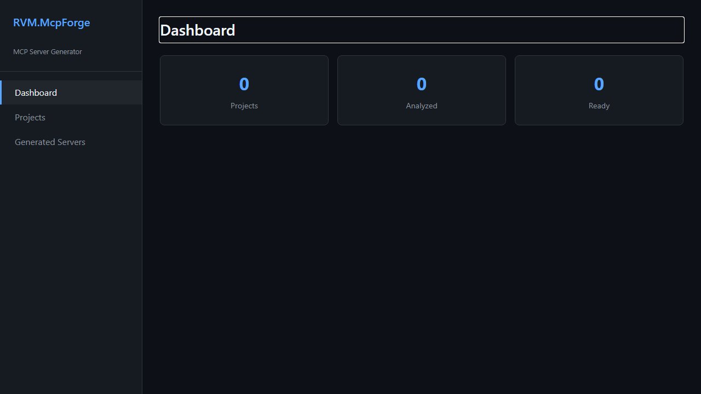
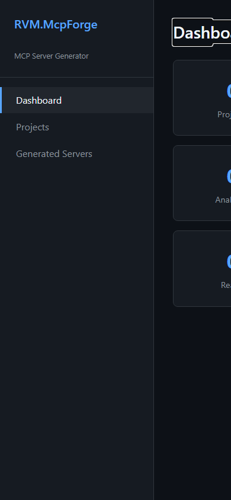
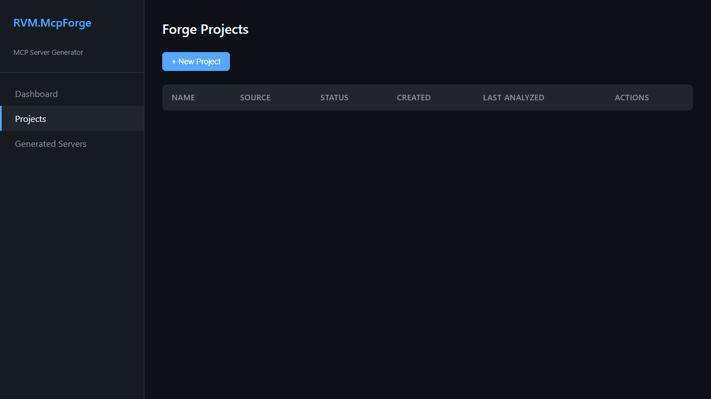
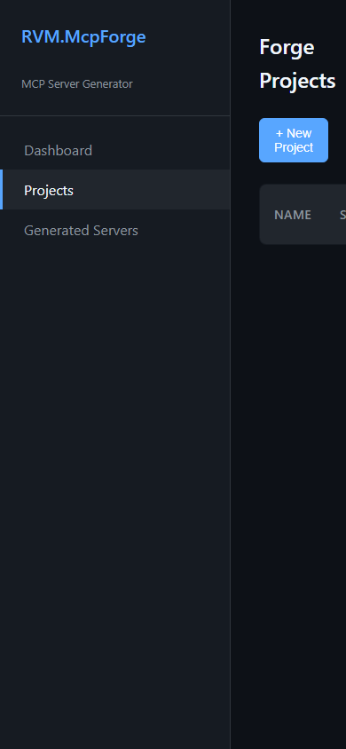
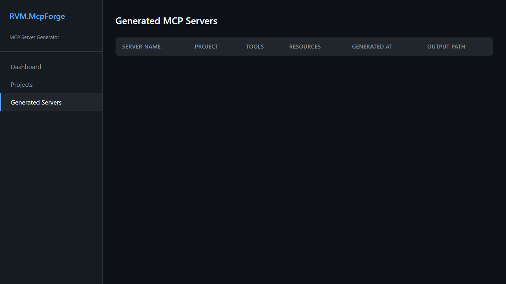
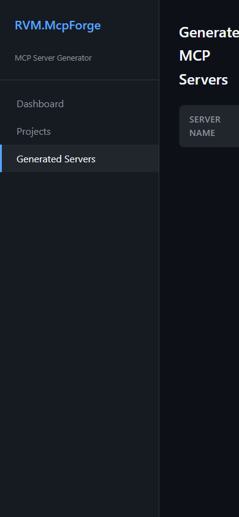

# RVM.McpForge - Manual do Usuario

> Gerador de MCP Servers — Guia Completo de Funcionalidades
>
> Gerado em 26/04/2026 | RVM Tech

---

## Visao Geral

O **RVM.McpForge** gera MCP Servers (Model Context Protocol) automaticamente
a partir de repositorios Git, schemas de banco de dados ou especificacoes de API REST.
O servidor MCP gerado e compativel com Claude Desktop e outros clientes MCP.

**Recursos principais:**
- **Geracao automatica** — MCP Server a partir de Git, Database ou API
- **Multiplas linguagens** — TypeScript ou Python
- **Configuracao pronta** — claude_desktop_config.json gerado automaticamente
- **Projetos organizados** — agrupe servidores MCP por dominio
- **Controle de versao** — historico de geracoes por servidor
- **Preview inline** — visualize o codigo antes de fazer download

---

## 1. Home / Introducao

Pagina inicial do RVM.McpForge. Apresenta o gerador de MCP Servers com exemplos de uso e acesso rapido as funcionalidades principais.

**Funcionalidades:**
- Visao geral do que e um MCP Server
- Exemplos de casos de uso (Git, Database, API)
- Acesso rapido a criacao de projetos
- Documentacao inline das funcionalidades
- Status do sistema e ultimas geracoes

> **Dicas:**
> - O MCP Server gerado e compativel com Claude Desktop e outros clientes MCP.
> - Comece criando um projeto para organizar seus servidores MCP.

| Desktop | Mobile |
|---------|--------|
|  |  |

---

## 2. Projetos

Gerencie seus projetos de MCP Servers. Cada projeto agrupa servidores MCP relacionados, com controle de versao e configuracoes compartilhadas.

**Funcionalidades:**
- Listagem de projetos com status e data de criacao
- Criar novo projeto com nome, descricao e tipo (Git, Database, REST API)
- Editar configuracoes do projeto
- Ver servidores MCP gerados por projeto
- Duplicar projeto como ponto de partida
- Arquivar ou excluir projetos

> **Dicas:**
> - Organize projetos por dominio (ex: "Financeiro", "CRM", "Infraestrutura").
> - Projetos arquivados ficam visiveis em filtro separado mas nao aparecem na lista principal.

| Desktop | Mobile |
|---------|--------|
|  |  |

---

## 3. Servidores MCP Gerados

Visualize e gerencie todos os MCP Servers gerados. Faca o download do codigo, copie as configuracoes para o Claude Desktop e veja o historico de versoes.

**Funcionalidades:**
- Listagem de servidores MCP por projeto
- Preview do codigo gerado com syntax highlight
- Download do servidor MCP como arquivo TypeScript/Python
- Configuracao pronta para copiar no Claude Desktop (claude_desktop_config.json)
- Historico de versoes por servidor
- Regenerar servidor com novas configuracoes
- Status: ativo, em rascunho, deprecado

> **Dicas:**
> - Copie a configuracao do Claude Desktop e cole em ~/Library/Application Support/Claude/claude_desktop_config.json (Mac) ou %APPDATA%/Claude/claude_desktop_config.json (Windows).
> - Apos adicionar a configuracao, reinicie o Claude Desktop para carregar o novo servidor.

| Desktop | Mobile |
|---------|--------|
|  |  |

---

## Informacoes Tecnicas

| Item | Detalhe |
|------|---------|
| **Backend** | ASP.NET Core + Blazor Server |
| **Banco de dados** | PostgreSQL 16 + EF Core |
| **Geracao de codigo** | Roslyn + T4 Templates |
| **Protocolo** | MCP (Model Context Protocol) — SDK oficial |
| **Deploy** | Docker Compose + Nginx |

---

*Documento gerado automaticamente com Playwright + TypeScript — RVM Tech*
